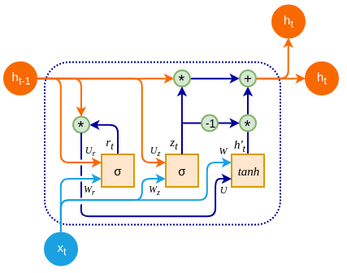

# Introduction

```{r, echo=FALSE}
knitr::opts_chunk$set(echo = FALSE, message = FALSE, warning = FALSE)
```

The rapid growth of cryptocurrencies over the past decade has
transformed them into a significant component of the global financial
system. However, the volatile and non-linear nature of cryptocurrency
prices presents unique challenges for accurate forecasting. Traditional
statistical methods often fall short in capturing the intricate temporal
dependencies and high volatility of cryptocurrency time series. As a
result, researchers have increasingly turned to deep learning models,
particularly Recurrent Neural Networks (RNNs), to address these
challenges [@NASIRTAFRESHI2022; @kumar23; @seable23] .

Recurrent Neural Networks (RNNs) are well-suited for time series
forecasting due to their ability to model sequential data and capture
temporal dependencies. Variants of RNNs, such as Long Short-Term Memory
(LSTM) and Gated Recurrent Unit (GRU), have been widely adopted for
cryptocurrency forecasting. These models are particularly effective in
handling long-term dependencies and mitigating the vanishing gradient
problem, which is common in traditional RNNs. For instance,
Nasirtafreshi (2022) proposed an RNN-LSTM model to predict
cryptocurrency prices, demonstrating its ability to outperform
traditional methods in terms of accuracy.

To further enhance the predictive performance of RNNs, researchers have
explored hybrid models that combine RNNs with other techniques. For
example, Guo et al. (2021) developed a hybrid method that integrates a
multiscale residual block with an LSTM network to forecast Bitcoin
prices. This approach leverages the strengths of both components: the
residual block captures multi-scale features, while the LSTM network
models temporal dependencies.

Similarly, other studies have proposed combining RNNs with convolutional
layers or graph-based methods to improve the model's ability to capture
spatial and temporal patterns in cryptocurrency data. The combined RNN
models offer several advantages over standalone RNNs or traditional
methods. By integrating complementary techniques, these models can
better handle the non-stationarity and noise inherent in cryptocurrency
time series. For instance, hybrid models that incorporate wavelet
transforms or attention mechanisms have been shown to improve feature
extraction and focus on relevant patterns in the data. Additionally,
ensemble approaches that aggregate predictions from multiple RNN-based
models have demonstrated enhanced robustness and accuracy in
cryptocurrency forecasting.

# Related works

Machine Learning is an artificial intelligence device that uses beyond
information to predict the future. In simple words, we can expect the
future price movements of cryptocurrencies to some extent by training a
machine learning model using their past price data. Some recent studies
have shown that machine learning based methods have many advantages of
using traditional forecasting models, such as the ability to produce
results that are approximately equal or identical to the actual outcome,
while also improving the precision of the outcome [@hitam2021]. Decision
trees, support vector machine, and neural networks are some of the
different machine learning methods that can be used for this purpose. As
evidenced by the authors in [@andrianto17], the inclusion of
cryptocurrencies in multi-asset portfolios significantly improves
portfolios in several ways. To start, it will enhance the portfolio’s
minimal variance and furthermore transfers the green frontier to a
higher location.

Several research studies in the literature that using machine learning
algorithms in BTC price forecasting achieve encouraging results.
According to a study [@hitam2021], machine learning algorithms were
applied to perform the price prediction of many currencies including
BTC, ETH, LTC, XRP, and Stellar. According to the researchers, the SVM
model was able to beat other machine learning models in terms of
predicted values as well as accuracy. [@saad19] used a variety of
variables, carefully choosing the most accurate predictors using
correlation analysis. The results showed that linear regression
performed better than the other approaches when SVM, linear regression,
and random forest (RF) were used to these selected features. The authors
also tried predicting the prices of BTC and ETH using LSTM, a specific
kind of deep learning, and discovered that LSTM had the lowest
prediction error for BTC. To predict the prices of nine different
cryptocurrencies, [@chowdhury20] studied the application of machine
learning-based ensemble methods, namely ANN, KNN, Gradient Boosted Trees
and an ensemble model made up of multiple methods. The ensemble learning
model had the the lowest error in the predictions. [@derbentsev21]
studies the difficulties faced when forecasting short-term
cryptocurrency time series using supervised machine learning (ML). The
ensemble methods were then applied to the daily closing prices of
Bitcoin (BTC), Ethereum (ETH), and Ripple (XRP) using historical prices
and technical indicators such as moving averages as features: Random
Forest (RF) and Stochastic Gradient Boosting Machine (SGBM). The results
showed that ML ensemble methods held promise, with SGBM and RF yielding
good accuracy on short-term predictions. [@chen2021] introduces a
two-stage approach to investigate whether economic and technology
determinants can accurately predict the Bitcoin exchange rate. In the
first stage, artificial neural networks and random forests are employed
as nonlinear feature selection methods to identify and prioritize key
predictors from economic and technology factors. In the second stage,
these selected predictors are integrated into a long short-term memory
(LSTM) model to forecast the Bitcoin exchange rate without relying on
historical exchange rate data. The results demonstrate that LSTM,
utilizing economic and technology determinants, outperforms traditional
models such as autoregressive integrated moving average, support vector
regression, adaptive network fuzzy inference system, and LSTM models
that depend on past exchange rates. This highlights that economic and
technology factors are more significant for predicting Bitcoin exchange
rates than historical exchange rate information. [@patel2020] introduce
a hybrid prediction model for cryptocurrencies, combining LSTM and GRU
networks, specifically applied to Litecoin and Monero. The results show
that our approach achieves highly accurate price predictions,
demonstrating its potential for broader use in forecasting the prices of
various cryptocurrencies. This suggests that the model could be a
valuable tool for understanding and predicting cryptocurrency market
trends. [@zhang2021] propose a model that is built around three key
modules designed to enhance cryptocurrency price prediction. First, the
Attentive Memory module integrates a Gated Recurrent Unit (GRU) with a
self-attention mechanism, allowing the model to focus on the most
relevant parts of each input sequence. Second, the Channel-wise
Weighting module analyzes the prices of major cryptocurrencies, learning
their relationships by dynamically adjusting the importance of each
sequence. Finally, the Convolution & Pooling module captures local
patterns in the data, improving the model’s ability to generalize. To
test its effectiveness, the authors ran a series of experiments, which
demonstrated that their model outperforms existing baseline methods in
terms of prediction error, accuracy, and profitability, achieving
state-of-the-art results. [@nouira2024] explore recent advancements in
machine learning and deep learning techniques used for predicting
cryptocurrency prices, as highlighted in highly regarded publications.
By focusing on the latest research, the authors analyze how these models
leverage social network data to forecast cryptocurrency trends. The
findings reveal a notable shift in the field, with deep learning methods
increasingly surpassing traditional machine learning approaches in
cryptocurrency price prediction. The study of [@vieitez2024] develops
prediction models for Ethereum (ETH) prices using Gated Recurrent Unit
(GRU) and Long Short-Term Memory (LSTM) networks, alongside a Support
Vector Machine (SVM) for trend classification. Sentiment analysis is
incorporated to assess its impact, though it shows minimal influence on
results. Two innovative knowledge-based investment strategies are
designed and tested across different time periods using real market
data. The findings reveal that these models can achieve a profit factor
of up to 5.16 with limited trading activity, demonstrating their
reliability and potential for generating returns in the current
cryptocurrency market. [@lapitskaya2024] combine technical analysis
tools—such as Moving Average Convergence/Divergence, Commodity Channel
Index, and Relative Strength Index—with the eXtreme Gradient Boosting
(XGBoost) model to predict cryptocurrency prices and returns. Using
historical daily data for Bitcoin, Ether, Golem, and FUNToken, the model
achieves strong accuracy and reliable performance across both training
and test datasets. This approach highlights the potential of integrating
traditional indicators with machine learning for effective
cryptocurrency price forecasting. Recent work of [@shirwaikar2025]
focuses on predicting the values of three cryptocurrencies—Litecoin,
Ethereum, and Monero—using deep learning techniques, specifically Long
Short-Term Memory (LSTM) and Gated Recurrent Unit (GRU). To enhance
accuracy, the research incorporates the Direction Algorithm (DA), which
analyzes Bitcoin’s price movements as a benchmark for other
cryptocurrencies, and Change Point Detection (CPD) using Pruned Exact
Linear Time (PELT) to identify sudden price shifts. Additionally,
sentiment analysis of news data is performed using the Vader algorithm
to further improve forecasting precision. The study of [@hafidi2025]
presents a novel method that automates hyperparameter tuning, boosting
accuracy by analyzing intricate relationships between cryptocurrencies.
Using advanced deep learning tools like RNNs and LSTMs, combined with
Genetic Algorithms (GA), the approach optimizes model performance. Two
architectures, LAO and LOEE, are introduced and compared to tackle the
volatility and complexity of cryptocurrency markets. By streamlining
hyperparameter selection and exploring cryptocurrency interconnections,
it delivers a reliable solution for predicting prices in a fast-changing
market.

# Methodology

In this section, we outline the steps taken during the research and
modeling phases. We then present the results of our predictive framework
for BTC price, followed by a comprehensive evaluation of performance and
research insights.

The aim of this study is to leverage advanced deep learning techniques —
such as LSTM, GRU, and LSTM-GRU - to forecast the prices of BTC. To
achieve this, we follow a structured process: (1) collecting historical
price data for BTC; (2) visualizing the data to uncover patterns; (3)
splitting the data into training and testing sets; (4) training the
three deep learning models; (5) validating the models; and (6) comparing
the performance of each method to identify the most effective approach.

## Dataset

For this study, the main emphasis is on analyzing the historical closing
price data of the BTC close price. This data is obtained from Yahoo
Finance. The closing price is a key indicator in financial time series
analysis, as it plays a significant role in forecasting and
understanding market trends. The closing price is a vital piece of
information widely utilized by investors, analysts, and traders to gauge
market trends and make well-informed decisions. It plays a central role
in many technical analysis methods and is frequently used to compute
moving averages, oscillators, and other financial metrics. These tools,
in turn, help shape trading strategies and guide decisions related to
portfolio management. Essentially, the closing price acts as a essential
element for understanding market behavior and planning investment
actions.

The data collection process gathers as much historical closing price
data as possible for the BTC close price spanning from January, 06, 2016
to February, 20, 2025. The \autoref{fig:BTC} represents the graph of
Bitcoin's (BTC) closing price typically illustrates the cryptocurrency's
price movements over a specific period, showcasing its volatility and
trends. Data summary table for BTC is given in \autoref{tab:table}.

```{r BTC, echo=F, comment=NA, message=FALSE, warning=FALSE, fig.align='center', out.width="85%", fig.cap="BTC close price series" }
library(tidyverse, quietly =T)
btc <- crypto2::crypto_history(limit = 2,
  start_date = "2016-01-06",
  end_date = "2025-02-20",
  
)
btc_c=btc %>% dplyr::filter(symbol=="BTC")%>%dplyr::select(time_close, close)
BTC=xts::xts(btc_c$close, btc_c$time_close )
forecast::autoplot(BTC)+xlab('Time')
```

## Pre-processing techniques

To prepare the BTC close price data for deep learning analysis, we applied several pre-processing steps. First, we reshaped the data to make it compatible with advanced neural network models like LSTM, GRU, and LSTM-GRU.

Then, we split the data into training and testing sets using an 90:10 ratio. This approach maintained the continuity of features for the BTC price, ensuring that the models could learn from a coherent dataset while being evaluated on a separate, unseen portion. These steps collectively ensured the data was well-prepared for robust and reliable deep learning analysis.

Finally, normalization was a crucial step to ensure the model’s accuracy and prevent bias. To handle the issue of variables with different scales, we applied feature-wise normalization using MinMax Scaling, which recent studies have shown to significantly improve model performance [@ahsan2021]. This technique helped standardize the data, making it easier for the models to learn patterns effectively.

```{python, echo=F, message=F }
#######################################
#       LSTM-GRU model                #
#######################################

# Prepare data for time series forecasting
import numpy as np

data=r.BTC

lookback = 20  # Number of previous time steps to use for prediction
delay = 1      # Number of time steps ahead to predict

# Function to create sequences for time series
def create_sequences(data, lookback, delay):
    X, y = [], []
    for i in range(len(data) - lookback - delay + 1):
        X.append(data[i:i + lookback])
        y.append(data[i + lookback + delay - 1])
    return np.array(X), np.array(y)

# Create training and validation datasets
split = int(0.8 * len(data))
train_data = data[:split]
val_data = data[split:]

X_train, y_train = create_sequences(train_data, lookback, delay)
X_val, y_val = create_sequences(val_data, lookback, delay)
```


```{r table, echo=FALSE, message=FALSE, warning=FALSE}
n_tr=floor(0.9*length(BTC))
# reshape data
"All data"=pastecs::stat.desc(BTC, norm = T)
"Training data"=pastecs::stat.desc(BTC[1:n_tr], norm = T)
"Test data"=pastecs::stat.desc(BTC[-(1:n_tr)], norm = T)
Table=cbind("All data"=`All data`, "Training data"=`Training data`,"Test data"= `Test data`)
colnames(Table)=c("All data","Training data","Test data")
Table=Table[-c(2:3,11:12,16,18:20),]
Table[1,]=as.integer(Table[1,])
knitr::kable(Table, digits = 3, align = "l", caption = "Descriptive statistics of BTC close price")
```


## Recurrent neural networks

Recurrent Neural Networks (RNNs) have the unique ability to understand
complex, short-term relationships in time series data. There are two
main types of RNNs: fully connected and partially connected. The first
RNN was created by [@williams1989] in the late 1980s, during a period
when interest in neural network architectures was on the rise, leading
to many significant advancements in this field. The second type of RNN is introduced in 2014 by [@chung2014].

### LSTM model

Long Short Term Memory networks, often referred to as LSTMs, are a
specific type of Recurrent Neural Network (RNN) designed to learning
long-term dependencies in data. They were first introduced by
[@hochreiter97] and have since been further developed and embraced by
many researchers in the field. LSTMs have proven to be highly effective
across a wide range of applications, which has contributed to their
popularity today. LSTM are an evolved form of traditional RNNs. They are
specifically engineered to manage the challenges that arise with
long-term dependencies, effectively addressing the vanishing gradient
issue by incorporating a mechanism that helps retain information over
extended periods [@hochreiter97]. Essentially, the LSTM architecture
consists of several interconnected memory blocks that function as
recurrent sub-networks. These memory blocks play a crucial role in both
preserving the network's state over time and controlling the flow of
information between the cells. In \autoref{fig:figlstm}^[Source: [@KILIC2023]], you can see the structure of
an LSTM block, which includes the input signal $x_t$, the output $h_t$,
and the activation function. The input gate is key in deciding which
pieces of information should be stored in the cell state, while the
output gate determines what information should be released from the cell
state. The forward training process of an LSTM network can be outlined
with the following equations: 
\begin{align}
i_t  =  & \sigma\left(W_i [h_{t-1}, x_t]+b_i \right)\\
f_t  = &  \sigma\left(W_f [h_{t-1}, x_t]+b_t \right) \\
c_t  = & f_t \odot c_{t-1}+i_t \odot \tanh\left(W_c \odot [h_{t-1}, x_t] +b_c \right) \\
o_t  = &  \sigma\left(W_o [h_{t-1}, x_t]+b_o \right) \\
h_t  = &  o_t\odot \tanh(c_t)
\end{align}
\newline

```{r figlstm, echo=FALSE, fig.align='center', fig.cap='Structure of LSTM cell', out.width="75%"}

```

## Gated Recurrent Units (GRU)

Gated Recurrent Units (GRU) are a type of Recurrent Neural Network (RNN) introduced by [@chung2014] 
as a more efficient alternative to traditional LSTM networks. Similar to LSTM, GRU are capable 
of handling input sequences of varying lengths and maintaining a state that captures past information. 
However, GRU simplify the architecture by using only two gates; an update gate to determine what 
information to keep and a reset gate to decide what information to forget. This streamlined design 
makes GRU less complex and faster to train compared to LSTM, which rely on multiple gates and an 
internal memory cell. Despite their simplicity, GRU often deliver comparable performance to LSTM 
across many tasks [@yang2020], making them a popular choice for sequence modeling.

```{r figgru, echo=FALSE, fig.align='center', fig.cap='Structure of GRU cell', out.width="75%"}

```

\autoref{fig:figgru}^[Source: [@vasilev2019]] represent the diagram of GRU cell. The hidden state at time $t$, denoted as $h_t$, is computed using the input at time $t$, $x_t$, 
and the previous hidden state, $h_{t-1}$, through the following equations [@dey2017]:
\begin{align}
z_t= & \sigma\left(W_z x_t+U_z h_{t-1}+b_z \right)\\
r_t= & \sigma\left(W_r x_t+U_rh_{t-1}+b_r \right)\\
\widehat{h}_t= & \phi\left(W_hx_t+U_h(r_t \odot h_{t-1})+b_r \right)\\
h_t= & (1-z_t)\odot h_{t-1}+z_t \odot \widehat{h}_{t}
\end{align}

## Hyperparameter tuning

Hyperparameter tuning using random search optimization for LSTM (Long Short-Term Memory) and GRU (Gated Recurrent Unit) models in time series prediction involves systematically exploring a predefined hyperparameter space to identify the optimal configuration that maximizes model performance. Key hyperparameters include the number of layers, hidden units, learning rate, batch size, dropout rate, and sequence length. Unlike grid search, random search randomly samples combinations of these hyperparameters from the specified ranges, which is more computationally efficient and often yields competitive results. For LSTM and GRU models, the process begins by defining the search space for each hyperparameter, followed by training and evaluating multiple model instances with different configurations using a validation set or cross-validation. Performance metrics such as Mean Squared Error (MSE) or Mean Absolute Error (MAE) are used to assess the models. The best-performing configuration is then selected for final training and testing time series data. This approach balances exploration and computational cost, making it suitable for optimizing complex recurrent neural networks like LSTM and GRU.

```{r hyper, echo=FALSE}
  "Hyperparameter"=c("Number of layers", "Number of units", "Learning rate", "Dropout rate", "Dense activation")
  "Range/Values"=c("1 to 3 (integer)","32 to 128 (Increments of 32)", "0.0001, to 0.01 (Logarithmic scale)", "0.1 to 0.5 (Increments of 0.1)", "['relu','sigmoid']")
  "LSTM"=c("1","96","0.0003", "0.1","relu")
  "GRU"=c("","","","","")
  "LSTM-GRU"=c("","","","","")
df=cbind(`Hyperparameter`,`Range/Values`)
df2=cbind(`Hyperparameter`,`LSTM`,`GRU`, `LSTM-GRU`) 
knitr::kable(df, caption="Hyperparameter space" )  

```

```{r hyperBest, echo=FALSE}
knitr::kable(df2, caption="Best Hyperparameters" )
```

## Performance Metrics

To assess how well the proposed RNN algorithms performed, we relied on two key metrics: root mean squared error (RMSE) and mean absolute error percentage (MAPE). These metrics help us evaluate the accuracy of the prediction models—the lower the RMSE and MAPE values, the more accurate and reliable the model's predictions are. Essentially, smaller values indicate better performance.

\begin{equation}
RMSE = \sqrt{\dfrac{\sum_{i=1}^n (a_i-p_i)^2}{n} }
\end{equation}

\begin{equation}
MAPE = \dfrac{100}{n}\sum_{i=1}^n \dfrac{|a_i-p_i|}{ai}
\end{equation}
Where $p_i$ represents the predicted value, $a_i$ denotes the actual value, and $n$ stands for the total number of time steps.

# Results

```{r,echo=FALSE, out.width="80%", fig.cap="Actual and predicted results using the LSTM model.", fig.align='center', fig.pos='H'}

```

```{r,echo=FALSE, out.width="80%", fig.cap="Actual and predicted results using the GRU model.", fig.align='center', fig.pos='H'}

```

```{r,echo=FALSE, out.width="80%", fig.cap="Actual and predicted results using the combined model.", fig.align='center', fig.pos='H'}

```

```{r, echo=FALSE}
'Train data'=c(1012.523, 14.961)
'Test data'=c(3094.497, 3.0135)
tt=cbind(`Train data`,`Test data`)
row.names(tt)=c( "RMSE", "MAPE (%)")
knitr::kable(tt, caption = "Performance results for the LSTM model", align = "l")
```


```{r, echo=FALSE}
'Train data'=c(1027.657, 9.020)
'Test data'=c(2224.180, 2.471)
tt1=cbind(`Train data`,`Test data`)
row.names(tt1)=c( "RMSE", "MAPE (%)")
knitr::kable(tt1, caption = "Performance results for the GRU model", align = "l")
```


```{r, echo=FALSE, eval=FALSE}
{'input_unit': 96,
 'n_layers': 1,
 'lstm_0_units': 96,
 'layer_2_neurons': 256,
 'Dropout_rate': 0.1,
 'dense_activation': 'relu',
 'learning_rate': 0.00030094925731594785,
 'lstm_1_units': 32,
 'lstm_2_units': 64}
```


# Acknowledgement(s) {.unnumbered}


# Disclosure statement {.unnumbered}

# Funding {.unnumbered}

# Notes on contributor(s) {.unnumbered}

# Nomenclature/Notation {.unnumbered}

# Notes {.unnumbered}

# References
